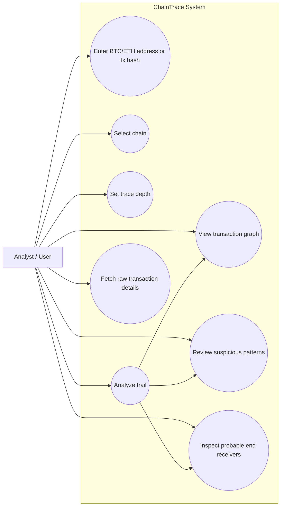
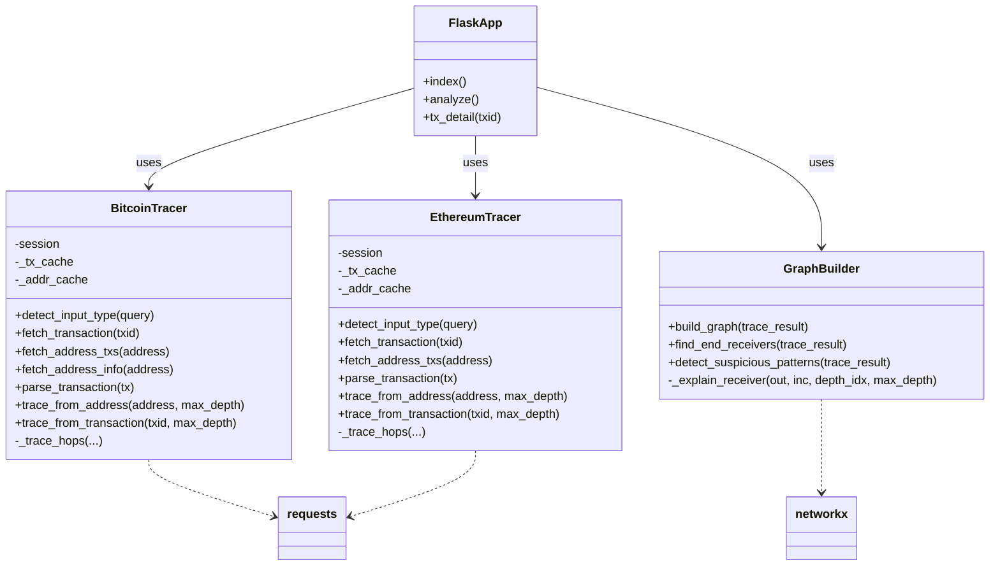
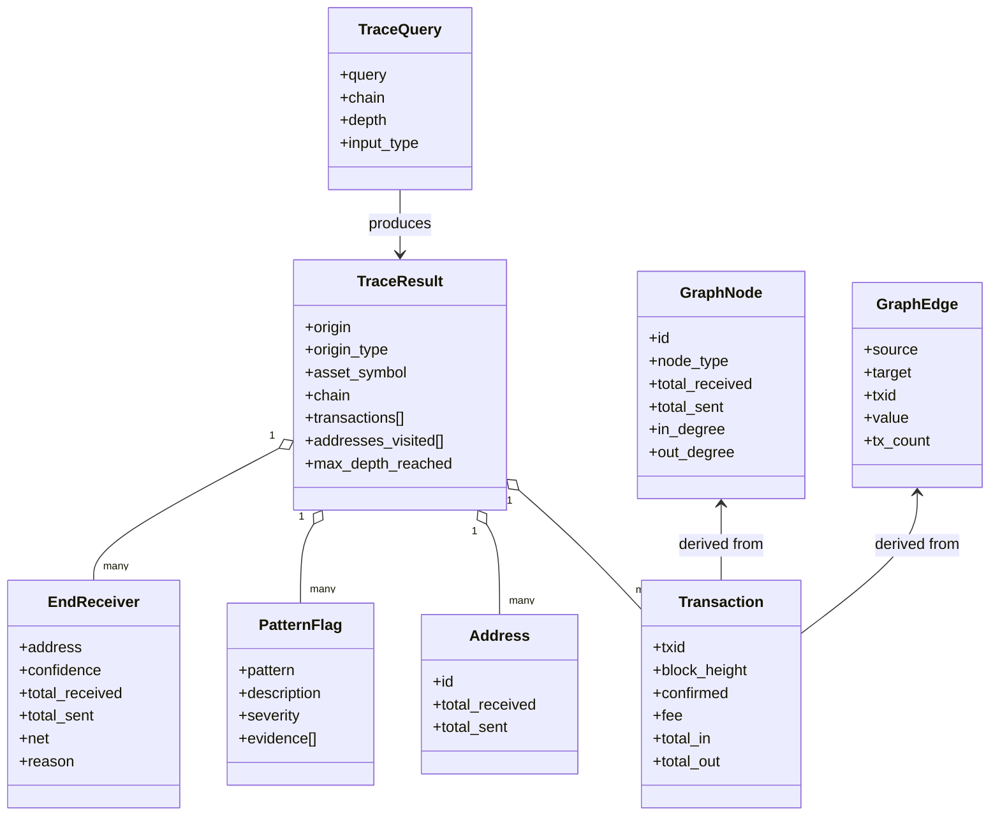
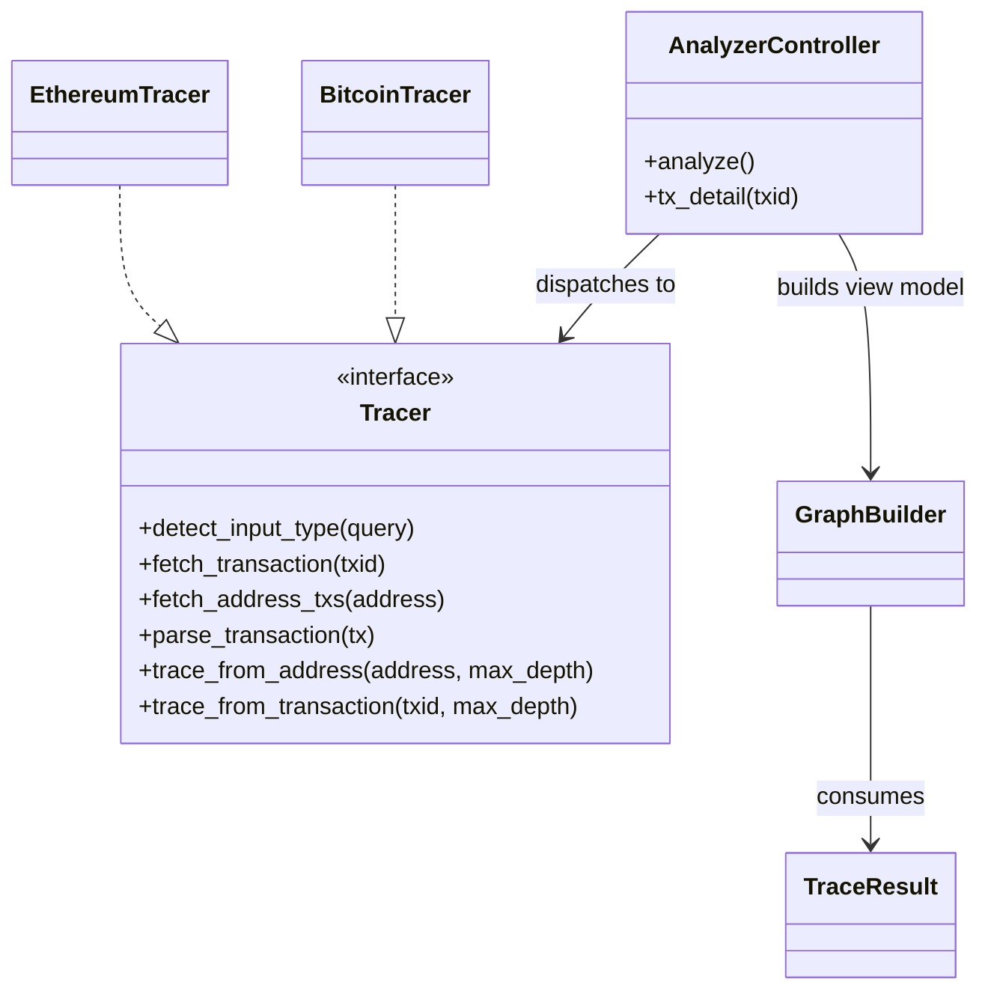
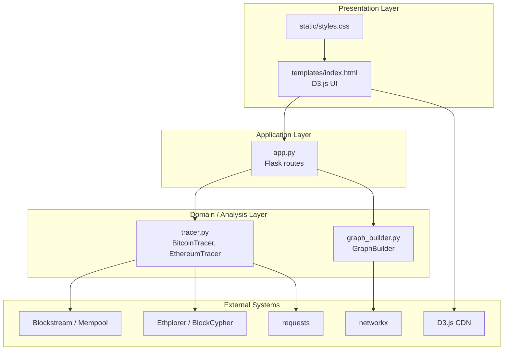

# ChainTrace — Multi-Chain Transaction Trail Analyzer
> A forensic-grade tool for tracing Bitcoin and Ethereum fund flows across public blockchains.

---

## 📁 Project Structure

```
bitcoin-tracer/
├── app.py            ← Flask server & API routes
├── tracer.py         ← Bitcoin + Ethereum data fetching & multi-hop tracing
├── graph_builder.py  ← Graph construction, end-receiver detection, pattern analysis
├── templates/
│   └── index.html    ← Frontend UI (HTML + D3.js visualization)
├── static/
│   └── styles.css    ← Dark forensic theme stylesheet
└── requirements.txt  ← Python dependencies
```

---

## 🧩 UML / Architecture Diagrams

The diagrams below are written in Mermaid so they can render in GitHub, VS Code Markdown previews, and Mermaid-compatible viewers.
The exported image files are also stored in [diagrams/README.md](diagrams/README.md).

## Deploying on Render

The project is configured for Render as a Python web service.

1. Create a new Render Web Service from this repository.
2. Use the included [render.yaml](render.yaml) blueprint, or set the service to run `gunicorn app:app`.
3. Keep the build command as `pip install -r requirements.txt`.
4. Render will provide the `PORT` environment variable automatically.

### 1) Functional Modeling (Use Case Diagram)



### 2) Static Class Diagram



### 3) Domain Model Diagram



### 4) Activity Diagram

```mermaid
flowchart TD
  start([User submits query]) --> chain{Select chain}
  chain --> input{Detect input type}
  input -->|Address| traceA[Trace from address]
  input -->|TX hash| traceT[Trace from transaction]
  input -->|Unknown| invalid[Return validation error]

  traceA --> fetch[Fetch and parse transactions]
  traceT --> fetch
  fetch --> recurse[Follow outputs up to max depth]
  recurse --> build[Build graph]
  build --> patterns[Detect suspicious patterns]
  patterns --> receivers[Score probable end receivers]
  receivers --> response[Return JSON to UI]
  response --> render[Render graph, stats, patterns, receivers]
  render --> end([Done])
  invalid --> end
```

### 5) Class Diagram



### 6) Package Diagram



---

## ⚙️ Setup & Run (Step-by-Step)

### Prerequisites
- Python 3.8 or higher
- pip
- Internet connection (uses free public APIs)

### Step 1 — Clone / download the project
```bash
cd bitcoin-tracer
```

### Step 2 — Create a virtual environment (recommended)
```bash
python -m venv venv

# Windows:
venv\Scripts\activate

# macOS / Linux:
source venv/bin/activate
```

### Step 3 — Install dependencies
```bash
pip install -r requirements.txt
```

### Step 4 — Run the Flask server
```bash
python app.py
```

### Step 5 — Open in browser
```
http://127.0.0.1:5000
```

---

## 🔬 Sample Test Inputs

| Chain | Type    | Value                                          | Notes                    |
|-------|---------|------------------------------------------------|--------------------------|
| BTC   | Address | `3J98t1WpEZ73CNmQviecrnyiWrnqRhWNLy`           | Active P2SH wallet       |
| BTC   | Address | `bc1qxy2kgdygjrsqtzq2n0yrf2493p83kkfjhx0wlh`  | SegWit bech32 address    |
| BTC   | Address | `bc1qw508d6qejxtdg4y5r3zarvary0c5xw7kv8f3t4`     | Bech32 address           |
| ETH   | Address | `0xde0B295669a9FD93d5F28D9Ec85E40f4cb697BAe`  | Sample Ethereum address  |
| ETH   | Address | `0x742d35Cc6634C0532925a3b844Bc454e4438f44e`  | Large ETH wallet         |

Use **Depth = 2** for faster results when testing.

---

## 🧠 How End Receivers are Determined

The system scores each address it encounters using **3 heuristics**:

| Heuristic | Points | Logic |
|-----------|--------|-------|
| H1 — No outgoing activity | +40 | Address never sent funds further → likely end destination |
| H2 — Accumulation ratio   | +35 | Receives significantly more than it sends → net accumulator |
| H3 — Chain depth          | +25 | Appears later in the traced chain → closer to final hop |

Total score is capped at 100. Addresses scoring > 20 are reported as candidates, sorted by confidence descending. The **Most Likely** label is given to the top scorer.

---

## ⚠️ Limitations

1. **Depth is limited** — Traces up to 5 hops to avoid overloading the free API. Deep laundering chains (10–20 hops) will not be fully traced.

2. **API rate limits** — The app relies on free public APIs. Very large wallets with many transactions may hit rate limits.

3. **Change address ambiguity** — Bitcoin transactions often include a "change" output back to the sender. The tool cannot always distinguish change outputs from true recipients.

4. **Mixer / CoinJoin opacity** — When funds pass through a mixing service, the link between input and output addresses is intentionally broken. The tool detects mixers but cannot trace through them.

5. **Address reuse** — Some wallets reuse addresses; others (HD wallets) generate a new address per transaction, making complete tracing harder.

6. **No private transaction support** — Confidential transactions (e.g., Lightning Network, Taproot with MAST) are not visible in the standard UTXO set.

7. **Heuristics are probabilistic** — End-receiver detection is based on observable patterns, not cryptographic proof. False positives are possible.

---

## 📡 APIs Used

- **Bitcoin: Blockstream.info** — `https://blockstream.info/api`
  - No API key required
  - `GET /address/{addr}/txs`
  - `GET /tx/{txid}`
  - `GET /address/{addr}`

- **Bitcoin fallback: mempool.space** — `https://mempool.space/api` (free)
  - Used automatically when Blockstream is unavailable or returns errors
  - Compatible endpoints:
    - `GET /address/{addr}/txs`
    - `GET /tx/{txid}`
    - `GET /address/{addr}`

- **Ethereum: Ethplorer** — `https://api.ethplorer.io` (free tier)
  - Uses public key `freekey`
  - `GET /getAddressTransactions/{address}?apiKey=freekey&limit=25`
  - `GET /getTxInfo/{txHash}?apiKey=freekey`

- **Ethereum fallback: BlockCypher** — `https://api.blockcypher.com/v1/eth/main` (free tier)
  - Used automatically when Ethplorer is unavailable or rate-limited
  - `GET /addrs/{address}/full?limit=25`
  - `GET /txs/{txHash}`

---

## 📚 Libraries

| Library    | Purpose                          |
|------------|----------------------------------|
| Flask      | Web server & API routes          |
| requests   | HTTP calls to blockchain API     |
| networkx   | In-memory graph processing       |
| D3.js (CDN)| Force-directed graph in browser  |
